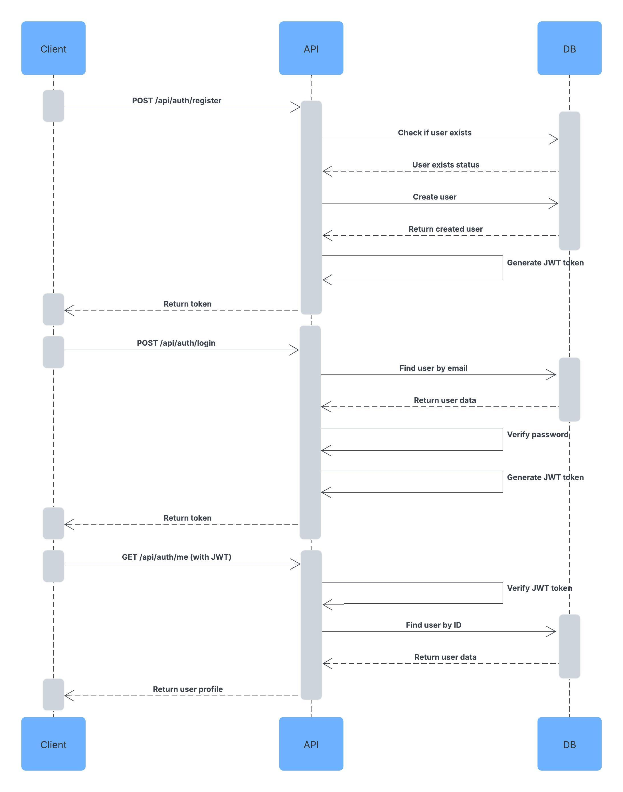

# Authentication Microservice

An authentication microservice with user management CRUD operations and JWT authentication, containerized with Docker.

## API Endpoints

### Public Routes
- `POST /api/auth/register` - Register a new user
- `POST /api/auth/login` - Login a user

### Protected Routes (require authentication)
- `GET /api/auth/me` - Get current user
- `PUT /api/auth/updatedetails` - Update user details
- `PUT /api/auth/updatepassword` - Update password
- `DELETE /api/auth/deleteuser` - Delete user

## Getting Started

### Prerequisites

- Docker and Docker Compose installed on your machine

### Installation

1. Clone the repository
2. Create a .env file with these variables:
   ```
   PORT=5000 # or another if this one is in use
   MONGO_URI=mongodb://mongo:27017/auth-service
   JWT_SECRET=your_jwt_secret_here  # replace with your own secret key
   JWT_EXPIRE=30d
   ```
3. Run `docker compose up` to start the app

## Communication Contract

### How to Request Data

To use this microservice, you'll need to make HTTP requests to the desired endpoint.

#### Base URL

If running locally, the base URL should be: `http://localhost:5000/api`

#### Authentication

For protected routes, include the JWT token in the Authorization header:
```
Authorization: Bearer YOUR_JWT_TOKEN
```

#### Endpoints

1. **Register a new user**
   - **URL**: `/auth/register`
   - **Method**: POST
   - **Body**:
     ```json
     {
       "name": "User Name",
       "email": "user@example.com",
       "password": "userpassword"
     }
     ```
   - **Example request using fetch**:
     ```javascript
     const response = await fetch('http://localhost:5000/api/auth/register', {
       method: 'POST',
       headers: {
         'Content-Type': 'application/json'
       },
       body: JSON.stringify({
         name: 'User Name',
         email: 'user@example.com',
         password: 'userpassword'
       })
     });
     const data = await response.json();
     // data.token contains the JWT token
     ```

2. **Login a user**
   - **URL**: `/auth/login`
   - **Method**: POST
   - **Body**:
     ```json
     {
       "email": "user@example.com",
       "password": "userpassword"
     }
     ```
   - **Example request using fetch**:
     ```javascript
     const response = await fetch('http://localhost:5000/api/auth/login', {
       method: 'POST',
       headers: {
         'Content-Type': 'application/json'
       },
       body: JSON.stringify({
         email: 'user@example.com',
         password: 'userpassword'
       })
     });
     const data = await response.json();
     // data.token contains the JWT token
     ```

3. **Get current user**
   - **URL**: `/auth/me`
   - **Method**: GET
   - **Authentication**: Required
   - **Example request using fetch**:
     ```javascript
     const response = await fetch('http://localhost:5000/api/auth/me', {
       method: 'GET',
       headers: {
         'Content-Type': 'application/json',
         'Authorization': 'Bearer YOUR_JWT_TOKEN'
       }
     });
     const data = await response.json();
     // data.data contains the user information
     ```

4. **Update user details**
   - **URL**: `/auth/updatedetails`
   - **Method**: PUT
   - **Authentication**: Required
   - **Body**:
     ```json
     {
       "name": "Updated Name",
       "email": "updated@example.com"
     }
     ```
   - **Example request using fetch**:
     ```javascript
     const response = await fetch('http://localhost:5000/api/auth/updatedetails', {
       method: 'PUT',
       headers: {
         'Content-Type': 'application/json',
         'Authorization': 'Bearer YOUR_JWT_TOKEN'
       },
       body: JSON.stringify({
         name: 'Updated Name',
         email: 'updated@example.com'
       })
     });
     const data = await response.json();
     ```

5. **Update password**
   - **URL**: `/auth/updatepassword`
   - **Method**: PUT
   - **Authentication**: Required
   - **Body**:
     ```json
     {
       "currentPassword": "oldpassword",
       "newPassword": "newpassword"
     }
     ```
   - **Example request using fetch**:
     ```javascript
     const response = await fetch('http://localhost:5000/api/auth/updatepassword', {
       method: 'PUT',
       headers: {
         'Content-Type': 'application/json',
         'Authorization': 'Bearer YOUR_JWT_TOKEN'
       },
       body: JSON.stringify({
         currentPassword: 'oldpassword',
         newPassword: 'newpassword'
       })
     });
     const data = await response.json();
     ```

6. **Delete user**
   - **URL**: `/auth/deleteuser`
   - **Method**: DELETE
   - **Authentication**: Required
   - **Example request using fetch**:
     ```javascript
     const response = await fetch('http://localhost:5000/api/auth/deleteuser', {
       method: 'DELETE',
       headers: {
         'Content-Type': 'application/json',
         'Authorization': 'Bearer YOUR_JWT_TOKEN'
       }
     });
     const data = await response.json();
     ```

### How to Receive Data

The microservice responds with JSON data. All responses follow this format:

```json
{
  "success": true|false,
  "token": "JWT_TOKEN",  
  "data": {},           
  "error": "Error message" 
}
```

Example response from register/login:
```json
{
  "success": true,
  "token": "eyJhbGciOiJIUzI1NiIsInR5cCI6IkpXVCJ9..."
}
```

Example response from GET profile:
```json
{
  "success": true,
  "data": {
    "_id": "1234567890",
    "name": "User Name",
    "email": "user@example.com",
    "createdAt": "2025-05-20T08:30:00.000Z"
  }
}
```

Example error response:
```json
{
  "success": false,
  "error": "Invalid credentials"
}
```

To process these responses in your code:

```javascript
const response = await fetch('http://localhost:5000/api/auth/me', {
  method: 'GET',
  headers: {
    'Authorization': 'Bearer YOUR_JWT_TOKEN'
  }
});

const data = await response.json();

if (data.success) {
  console.log('User data:', data.data);
} else {
  console.error('Error:', data.error);
}
```

## UML Sequence Diagram


